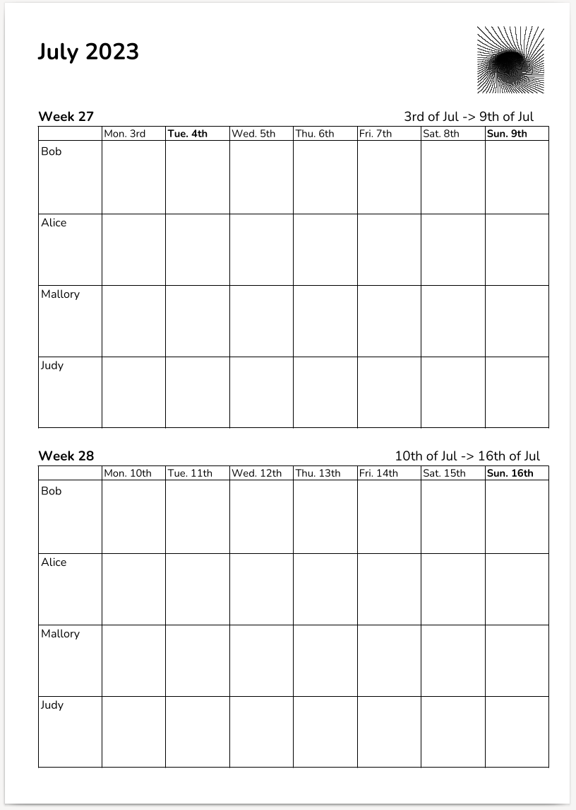
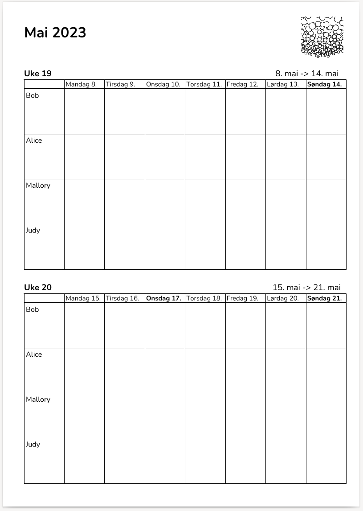

# Kitchen Calendar System

  

Kitchen Calendar is a utility written in Go that can generate PDF files.

Each year has 52 weeks. Each generated PDF document is a calendar for two specific weeks, for example week 7 and 8.

The utility also takes a list of comma separated names that are used in the weekly overviews.

This type of calendar can work great if for instance a family of 4, a couple of co-workers or people that are living together needs to collaborate.

By printing out and hanging up the calendars on the kitchen cupboard doors, there are no excuses for not having a good overview of what is happening in the weeks ahead, nor for what has been done or completed.

I recommend printing out at least 6 pages, which covers 12 weeks, and hang them all up. It does occupy quite a bit of "visual space" in the kitchen, but it's immensely handy and practical.

The reason why I wrote this utility is because we use it in my family, and it works better for us than Google Calendar or other apps or web pages. The information is readily available without anyone having to "do anything" to see it, and one can easily add entries while making tea or coffee.

In addition to this, "red dates" (holidays / flag flying dates) are written in bold text in the calendar. The functionality for detecting "red days" comes from the [kal](https://github.com/xyproto/kal) package.

Currently, only US and Norwegian calendars can be generated, but pull requests for supporting other locales are welcome!

The line art images comes from the excellent [ln](https://github.com/fogleman/ln) package.

### Example US PDF

Note that the 4th of July is in bold.

### Example Norwegian PDF

Note that the 17th of May is in bold.

### Installation

Go 1.17 or later is needed for `go install` to work as expected.

Install the US kitchen calendar generator:

    go install -tags en_US github.com/xyproto/kitchencalendar@latest

Install the Norwegian kitchen calendar generator:

    go install -tags nb_NO github.com/xyproto/kitchencalendar@latest

### Usage

For creating a `calendar_w8_2023.pdf` file:

    kitchencalendar -names Bob,Alice,Mallory,Judy -year 2023 -week 8

For generating calendars for week 7 to 17 (with 2 weeks on each PDF), for this year

    for x in $(seq 7 2 17); do kitchencalendar -names Bob,Alice,Mallory,Judy -week $x; done

### General info

* Version: 1.0.3
* License: BSD-3
* Author: Alexander F. Rødseth
