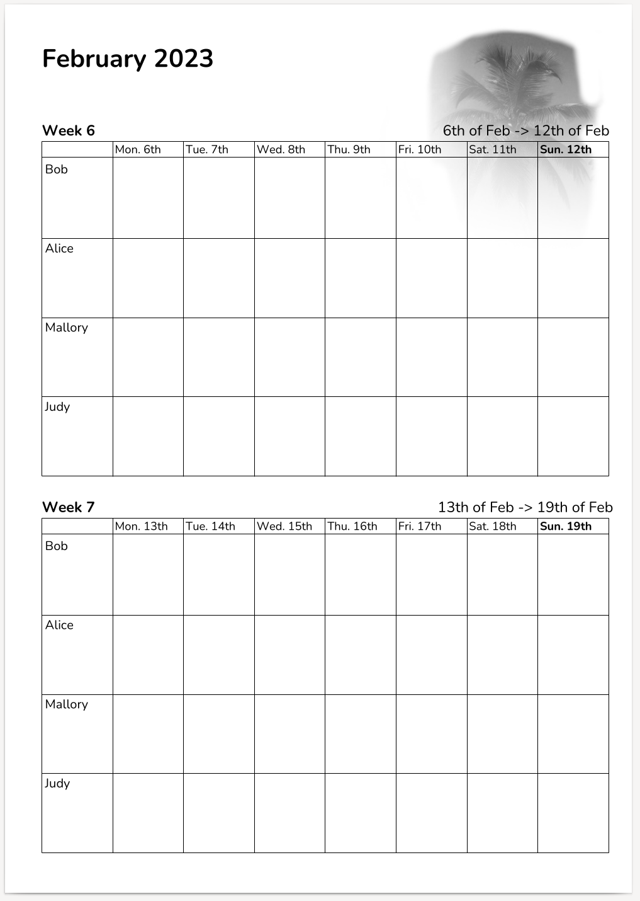

# Kitchen Calendar

Generate per-week calendars that can be printed out and hung up in the kitchen.

This program is a work in progress.

For instance, print out calendars for the next 10 weeks and attach them to the cupboard doors with Blu Tack or another adhesive.

It gives a very nice and hands-on overview of the coming weeks, and it's easy to sync and align what's happening with other people.

Currently, only Norwegian and US calendars are supported, but pull requests are welcome!

### Example PDF

Version 0.1.0:

Version 0.2.0:

### Getting started

Go 1.17 or later is needed for `go install` to work as expected.

Install the US calendar utility:

    go install -tags en_US github.com/xyproto/kitchencalendar@latest

Install the Norwegian calendar utility:

    go install -tags nb_NO github.com/xyproto/kitchencalendar@latest

For creating a `calendar.pdf` file:

    kitchencalendar -names Bob,Alice,Mallory,Judy -year 2023 -week 8

For generating calendars for week 7 to 17 (with 2 weeks on each PDF), for this year

    for x in $(seq 7 2 17); do kitchencalendar -names Bob,Alice,Mallory,Judy -week $x -o week$x.pdf; done

Pull requests for additional locales are welcome!

### Building with make

Fetch the sources:

    git clone https://github.com/xyproto/kitchencalendar
    cd kitchencalendar

Building all calendars:

    make

This results in `kitchencalendar_us`, `kitchencalendar_no` etc.

### General info

* Version: 0.2.0
* License: BSD-3
* Author: Alexander F. Rødseth &lt;xyproto@archlinux.org&gt;
